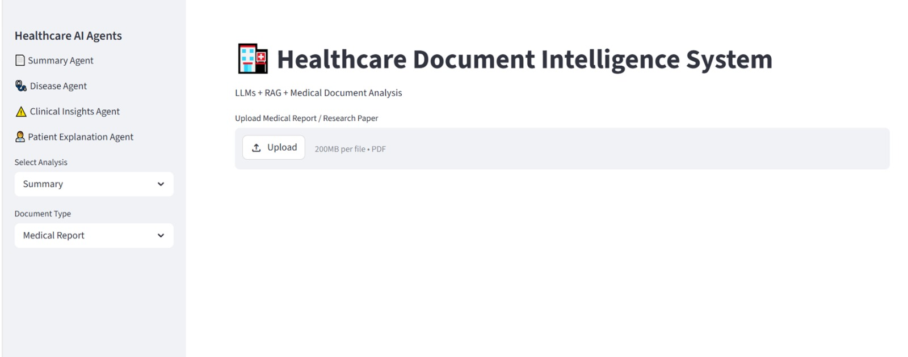
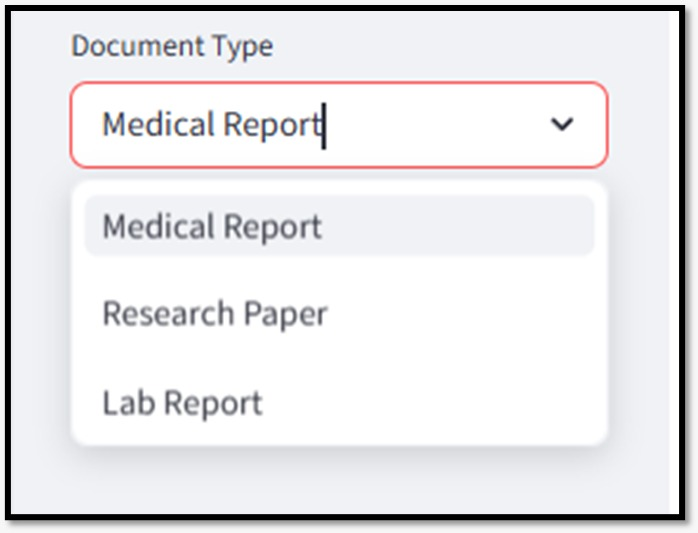
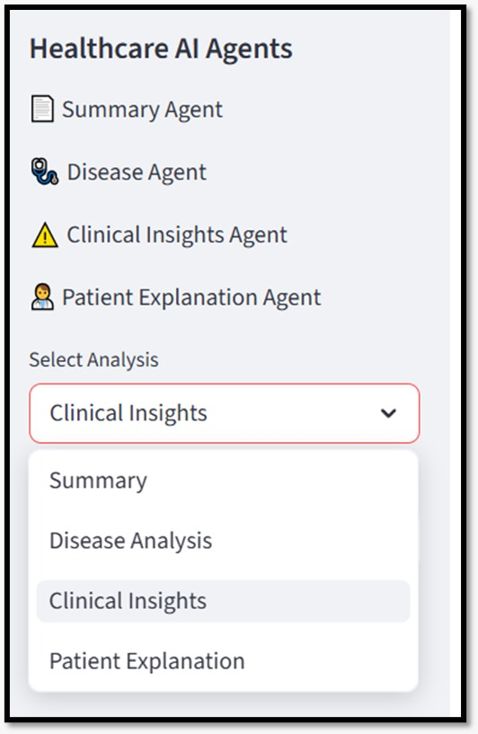
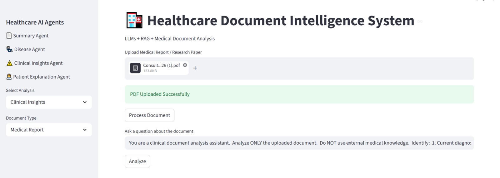
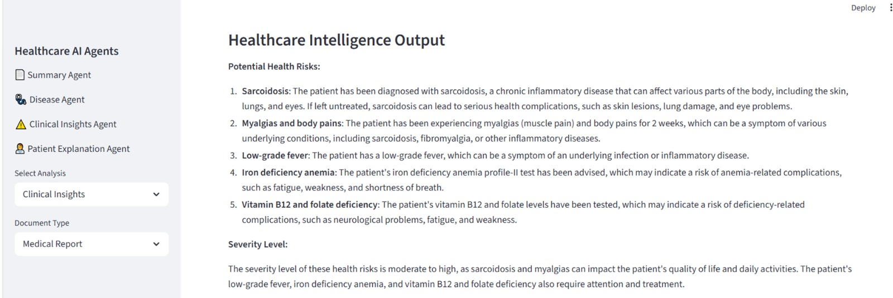
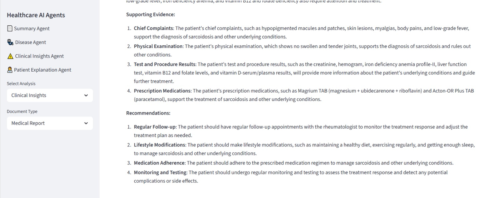

# Healthcare Document Intelligence System

An AI-powered Healthcare Document Intelligence System that combines **Retrieval-Augmented Generation (RAG)** with **Large Language Models (LLMs)** to intelligently analyze healthcare documents such as medical reports, laboratory reports, consultation notes, and research papers.

---

## Features

- Upload healthcare PDF documents
- Generate concise document summaries
- Disease identification and analysis
- Extract important clinical insights
- Patient-friendly explanation of medical reports
- Semantic document retrieval using FAISS
- Powered by Groq Llama 3.1

---

## Technologies Used

- Python
- Streamlit
- LangChain
- Hugging Face Sentence Transformers
- FAISS
- Groq API
- Llama 3.1
- Retrieval-Augmented Generation (RAG)

---

# Application Screenshots

## Home Page



---

## Document Type Selection



---

## Agent Selection



---

## Clinical Insights Output



---

## Sample Output



---

## Sample Output (Continued)



---

# Project Structure

```text
Healthcare-Document-Intelligence-System/
│
├── agents/
├── assets/
├── app.py
├── requirements.txt
└── README.md
```

---

# Installation

```bash
git clone https://github.com/Medha-Kauluri/Healthcare-Document-Intelligence-System.git

cd Healthcare-Document-Intelligence-System

pip install -r requirements.txt

streamlit run app.py
```

---

# Future Enhancements

- OCR support for scanned reports
- Explainable AI (XAI)
- Electronic Health Record integration
- Medical Knowledge Graph
- Multimodal healthcare analysis

---

# Author

**Medha Kauluri**
